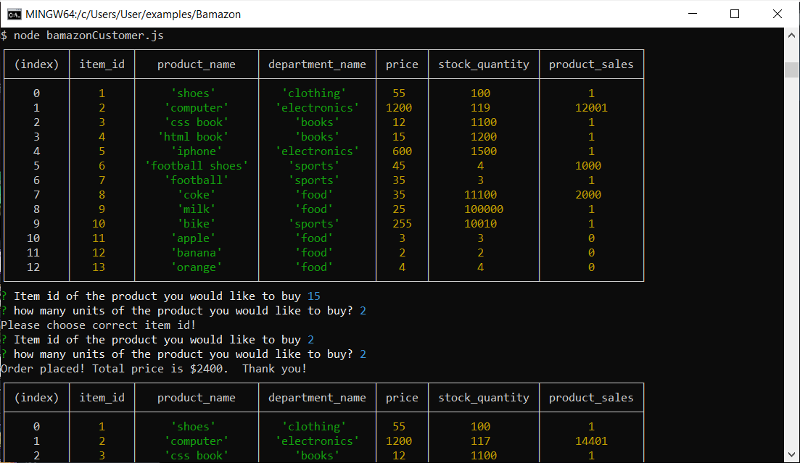
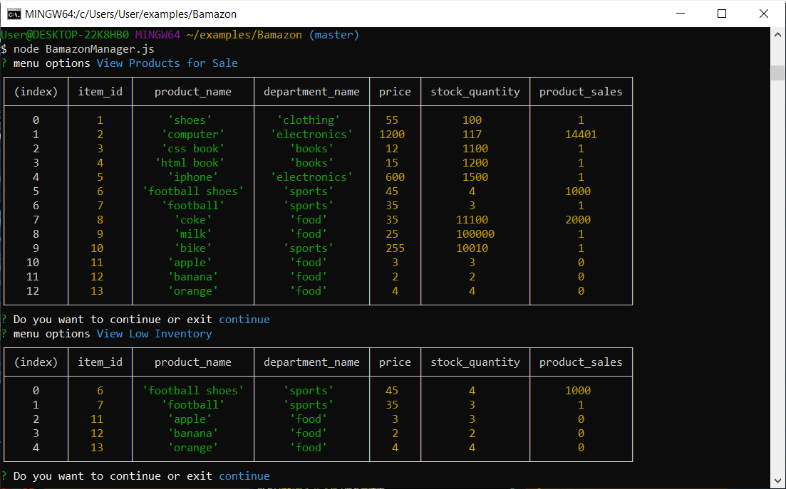
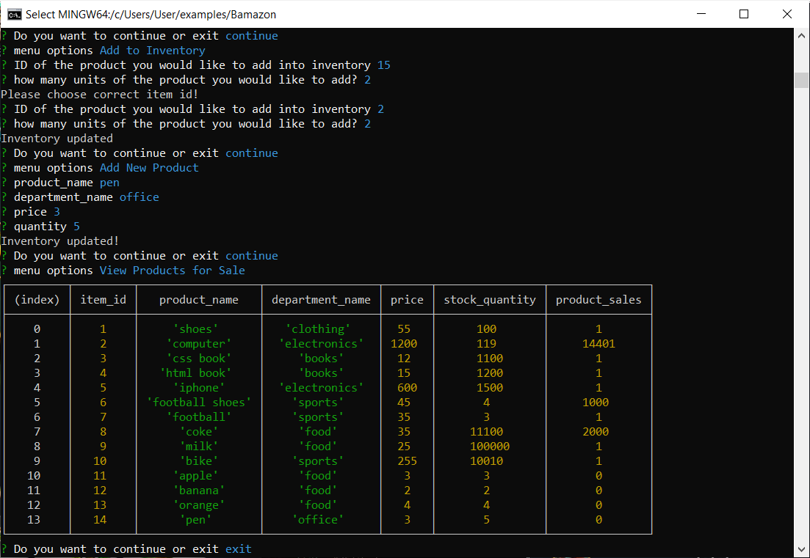
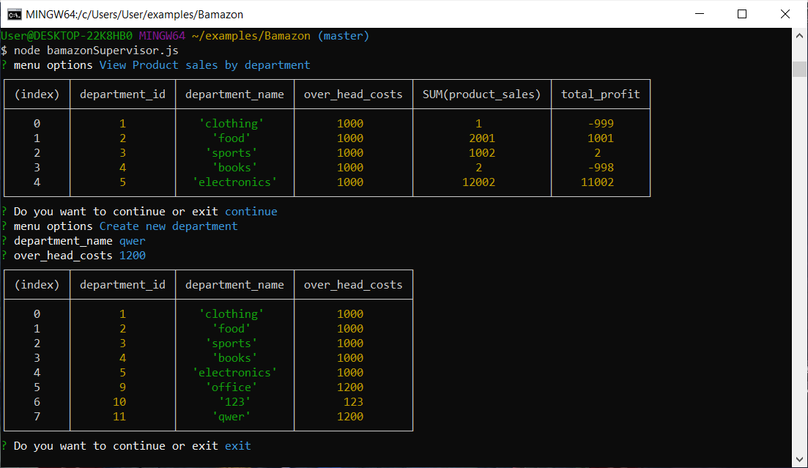

# Bamazon
* This an Amazon-like storefront app.
1. Customer
* The first should ask them the ID of the product they would like to buy.
The second message should ask how many units of the product they would like to buy.
If not, the app should log a phrase like Insufficient quantity!, and then prevent the order from going through.
If your store does have enough of the product, you should fulfill the customer's order.
This means updating the SQL database to reflect the remaining quantity.
Once the update goes through, show the customer the total cost of their purchase.
* 
* [click link for demo](https://drive.google.com/file/d/1YpinEbwT8Z7eL2QtYElgHpfq2OrAskH-/view)
2. Manager
* If a manager selects View Products for Sale, the app should list every available item: the item IDs, names, prices, and quantities.

If a manager selects View Low Inventory, then it should list all items with an inventory count lower than five.

If a manager selects Add to Inventory, your app should display a prompt that will let the manager "add more" of any item currently in the store.

If a manager selects Add New Product, it should allow the manager to add a completely new product to the store.
* 
* 
* [click link for demo](https://drive.google.com/file/d/1HDPZGZlNiBRBh4LkTbTkJ-oSwTdrBW3B/view)
3. supervisor
* The supervisor interface presents options:
View Product Sales by Department: If the supervisor selects View Product Sales by Department, it lists the Department Sales and calculates the total sales from the overhead cost and product sales.
Create New Department: If the supervisor selects Create New Department, it allows the manager to create a new department and input current overhead costs and product sales.

* 
* [click link for demo](https://drive.google.com/file/d/1BjNhm3Fhtn8N9dNFnL0j_KkfsKyhrvsW/view)
## Technologies Used
* Javascript
* nodeJS
* MySQL
* npm packages:
* mysql
* inquirer

